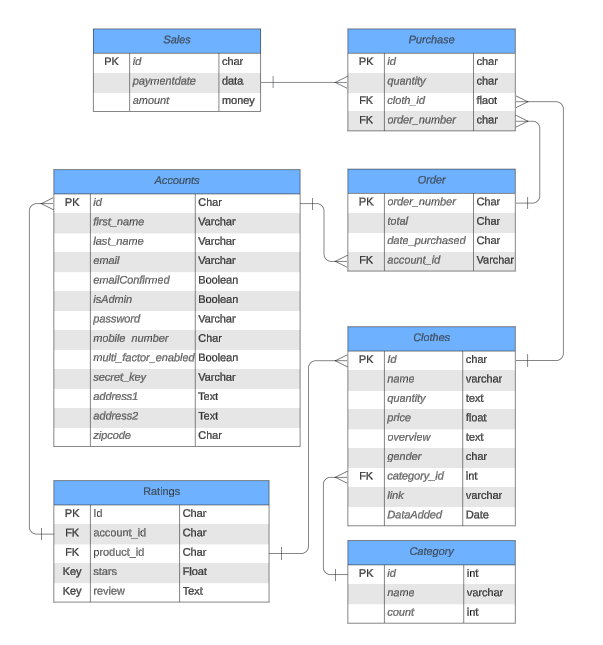
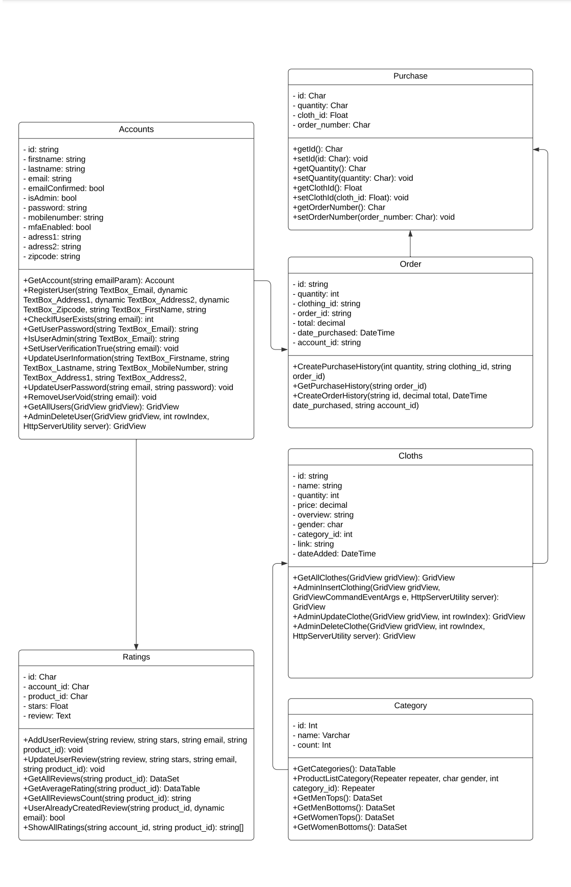
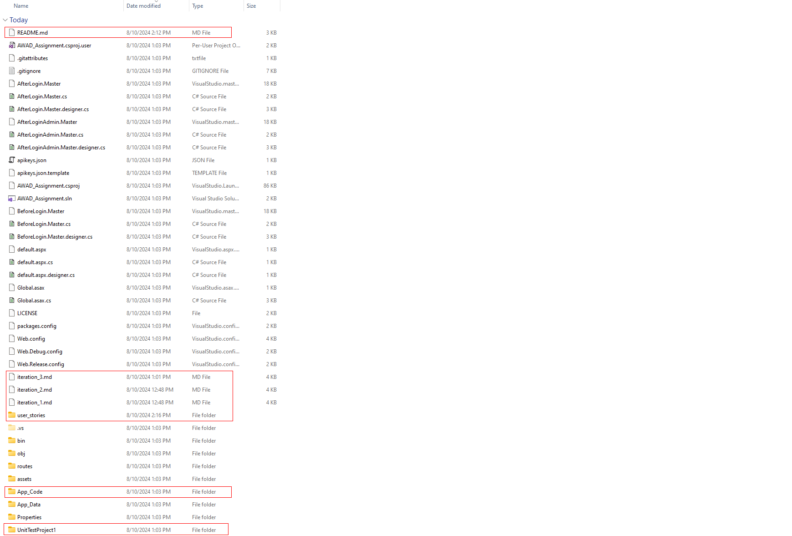

 
# CP3407 Project (Group 9） 

This a project assignment template for CP3407. 
 

## Team

* Name: Zhou Jie
* Student ID: 14499653
 

# *General* project planning BEFORE iteration-1 

### Iteration 1 [3 weeks], [June 7 2024 - June 28,2024]

1. [Login/Logout](./user_stories/user_story_01_Login_Logout.md), priority 10, 2 days
2. [View Cart](./user_stories/user_story_08_View_Cart.md), priority 10, 4 days
3. [User Profile](./user_stories/user_story_06_User_Profile.md), priority 20, 3 days
4. [Add a product to cart](./user_stories/user_story_07_Add_Product_To_Cart.md), priority 10, 5 days
5. [Rating system](./user_stories/user_story_13_Rating_System.md), priority 20, 2 days
6. [Review System](./user_stories/user_story_14_Review_System.md), priority 20, 5 days

Total: 21 days

### Iteration 2 [about 3 weeks], [June 29, 2024 - July 20, 2024]
1. [Edit Cart](./user_stories/user_story_09_Edit_Cart.md), priority 20, 5 days
2. [Order Tracking](./user_stories/user_story_11_Order_Tracking.md), priority 20, 5 days
3. [Delete a product](./user_stories/user_story_04_Delete_Product.md), priority 30, 3 days
4. [Checkout and payment](./user_stories/user_story_10_Checkout_Payment.md), priority 30, 5 days
5. [Create a product](./user_stories/user_story_02_Create_Product.md), priority 40, 3 days

Total: 21 days

### Iteration 3 [about 3 weeks], [July 21, 2024 - August 10, 2024]
1. [Edit product](./user_stories/user_story_03_Edit_Product.md), priority 40, 7 days
2. [Delete a user](./user_stories/user_story_12_Delete_User.md), priority 50, 3 days
3. [Payment history](./user_stories/user_story_05_Payment_History.md), priority 50, 6 days
4. [Two-factor authentication](./user_stories/user_story_16_TwoFactor.md), priority 50, 1 days
5. [Register](./user_stories/user_story_17_Register.md), priority 50, 2 days

Total: 19 days

### Not enough time/developers: 
N/A

# Actual iterations
1. [Iteration-1](./iteration_1.md)
2. [Iteration-2](./iteration_2.md)
2. [Iteration-3](./iteration_3.md)

# New UML diagram:
1.[UML](user_stories/pictures/new_UML1.png) 

# New Class diagram:
1.[Class diagram](user_stories/pictures/new_Class_Diagram.png)

# Important File Location:
  

 Class files: /App_Code 
Code files: /routes 
Test file: /UnitTestProject1/UnitTest1.cs  
Schema: /sql_schema_script.sql  
Documentation: /  
For the /Routes:  
.aspx.aspx contain the frontend codes  
.aspx.cs contain the backend codes  
.aspx.designer.cs contain the website's system code  

# Finding Hidden folders:
If the files can't be seen, please use the following methods:

 
1.[Click on the "show all files](user_stories/pictures/find_all_files1.png) 
 
1.[Find from the file explorer ](user_stories/pictures/find_all_files2.png) 
 

# End of readme
