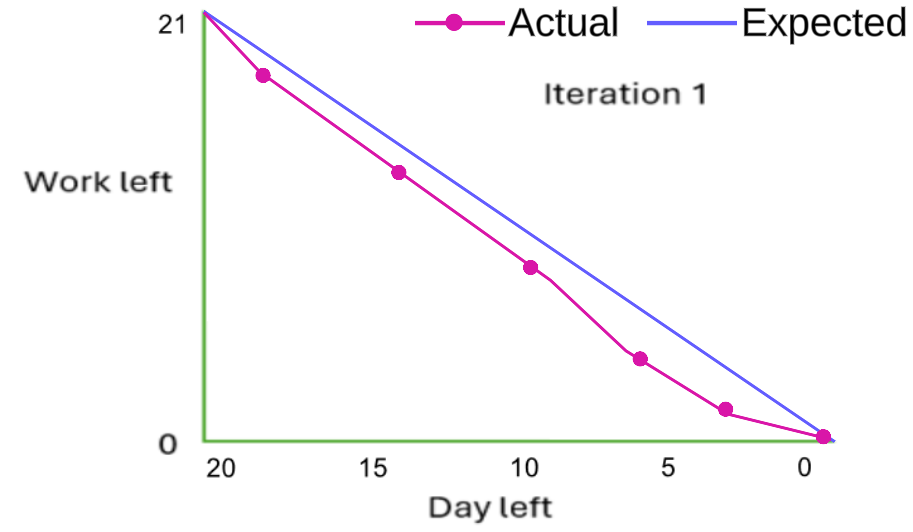

# Actual iteration-1 board, [June 7 2024 - June 28,2024]

* Assumed Velocity: 0.71 
* Number of developers: 1
* Total estimated amount of work: 21 days

User stories or Tasks (see chapter 4):

1. [Login/Logout](./user_stories/user_story_01_Login_Logout.md), priority 10, 2 days
2. [View Cart](./user_stories/user_story_08_View_Cart.md), priority 10, 4 days
3. [User Profile](./user_stories/user_story_06_User_Profile.md), priority 20, 3 days
4. [Add a product to cart](./user_stories/user_story_07_Add_Product_To_Cart.md), priority 10, 5 days
5. [Rating system](./user_stories/user_story_13_Rating_System.md), priority 20, 2 days
6. [Review System](./user_stories/user_story_14_Review_System.md), priority 20, 5 days

In progress: None

Completed:
* Task 1: Create a login form with fields for email and password.
* Task 2: Add a Sign Out button for logging out and redirecting users to the login page.
* Task 3: Implement password reset functionality with email verification and update form.
* Task 4: Develop authentication logic to verify user credentials and hash passwords.
* Task 5: Implement session management to handle login sessions and logout processes.
* Task 6: Develop a shopping cart interface that displays each product with its image, name, price, quantity, and total cost.
* Task 7: Add an "Update Cart" button to reflect changes in product quantities.
* Task 8: Display the subtotal of all items in the cart to help users track their spending.
* Task 9: Set up an SQL connection to retrieve the current cart contents for the logged-in user from the database.
* Task 10: Develop a user interface to display personal information fields, including first name, last name, and contact number.
* Task 11: Implement input fields for updating shipping details, such as address line 1, address line 2, and postal code.
* Task 12: Add functionality to allow users to update their passwords securely.
* Task 13: Set up an SQL connection to retrieve and update user profile information in the database.
* Task 14: Develop a product details page displaying the product image, name, price, and description.
* Task 15: Implement dropdown menus for selecting product options such as size and color.
* Task 16: Add an input field to specify the desired quantity of the product.
* Task 17: Implement the "Add to Cart" button functionality to add the selected product and quantity to the user's virtual shopping cart.
* Task 18: Set up an SQL connection to retrieve product details and available options from the database.
* Task 19: Implement logic to handle the addition of products to the user's shopping cart in the database.
* Task 20: Develop a star rating interface on the product details page to allow users to rate products out of five stars.
* Task 21: Display the overall product rating based on cumulative user ratings.
* Task 22: Set up an SQL connection to store user ratings in the database.
* Task 23: Implement logic to capture user ratings and store them securely in the database.
* Task 24: Retrieve cumulative ratings from the database to calculate and display the overall product rating.
* Task 25: Develop a review interface on the product details page to allow users to write and submit reviews.
* Task 26: Display submitted reviews below the review section for other customers to read.
* Task 27: Set up an SQL connection to store user reviews in the database.
* Task 28: Implement logic to capture user reviews and store them securely in the database.
* Task 29: Retrieve submitted reviews from the database and display them on the product details page.

### Burn Down for iteration-1:

Update this at least once per week
* 3 weeks left: 21 days of estimated amount of work
* 2 weeks left: 14 days of estimated amount of work
* 1 week left: 7 days of estimated amount of work
* 0 weeks left: 0 days of estimated amount of work

Actual Velocity: 1