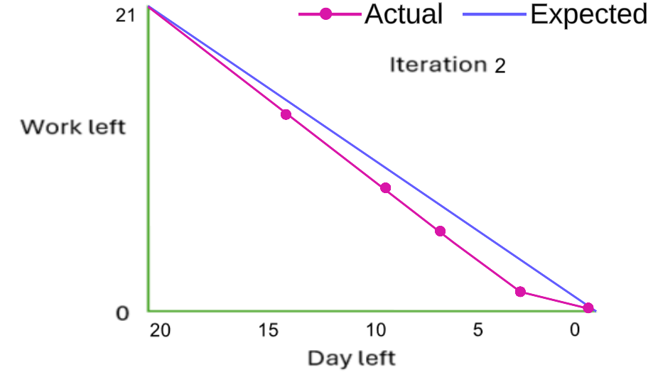

# Actual iteration-2 board, [June 29, 2024 - July 20, 2024]
 
* Assumed Velocity FROM iteration-2: 0.71
* Number of developers: 1
* Total estimated amount of work: 21 days

User stories or tasks (see chapter 4):
1. [Edit Cart](./user_stories/user_story_09_Edit_Cart.md), priority 20, 5 days
2. [Order Tracking](./user_stories/user_story_11_Order_Tracking.md), priority 20, 5 days
3. [Delete a product](./user_stories/user_story_04_Delete_Product.md), priority 30, 3 days
4. [Checkout and payment](./user_stories/user_story_10_Checkout_Payment.md), priority 30, 5 days
5. [Create a product](./user_stories/user_story_02_Create_Product.md), priority 40, 3 days

In progress: None

Completed:
* Task 1: Develop a form interface for editing existing products, including fields for name, quantity, price, overview, category selection, gender tags, and a URL link for additional information.
* Task 2: Add the ability to save changes to the product.
* Task 3: Set up an SQL connection to update product details in the database securely.
* Task 4: Develop an order tracking interface to display essential order information, including order number, date, total amount, and payment method.
* Task 5: Implement functionality to display shipping address details for each order.
* Task 6: Set up an SQL connection to retrieve order information and status from the database.
* Task 7: Implement logic to update and track the status of orders in the database.
* Task 8: Add a delete icon or button next to each product entry in the product management interface.
* Task 9: Update the product list view dynamically to remove the deleted product from the display immediately.
* Task 10: Set up an SQL query to handle the deletion of the selected product from the database.
* Task 11: Implement logic to execute the SQL query securely and ensure the product is removed from the database.
* Task 12: Develop a checkout interface where users can enter their shipping details.
* Task 13: Display an order summary on the checkout page, showing product details, subtotal, shipping cost, and total amount due.
* Task 14: Implement functionality to select between different payment methods, such as credit/debit card or PayPal.
* Task 15: Integrate Stripe API to provide a secure and user-friendly template for entering payment information.
* Task 16: Implement a "Pay" button to complete the purchase after verifying all entered information.
* Task 17: Set up an SQL connection to store and retrieve order and payment details securely.
* Task 18: Implement logic to process the payment using the selected payment method, ensuring secure transactions.
* Task 19: Integrate Stripe API on the back-end to handle payment processing and validation.
* Task 20: Develop a form interface for creating a new product.
* Task 21: Implement functionality to upload product images from the administrator's device.
* Task 22: Add the ability to save the new product or cancel the operation.
* Task 23: Set up an SQL connection to handle the creation and storage of new product details in the database.
* Task 24: Implement data validation to ensure all required fields are complete and correct before saving.
* Task 25: Develop logic to manage product categorization, gender tagging, and secure storage of uploaded product images.

### Burn Down for iteration-2:

Update this at least once per week
* 3 weeks left: 21 days of estimated amount of work
* 2 weeks left: 14 days of estimated amount of work
* 1 week left: 7 days of estimated amount of work
* 0 weeks left: 0 days of estimated amount of work
* Actual Velocity: 0.98