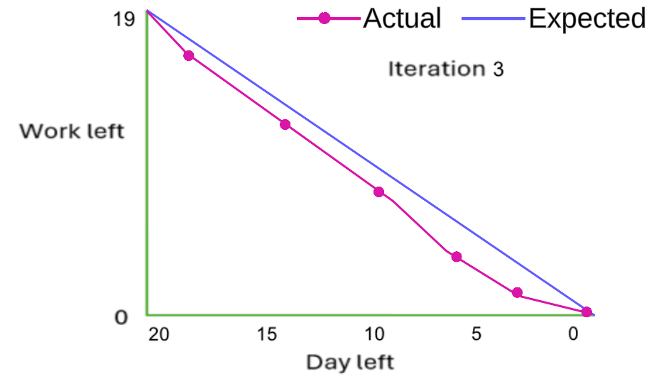

# Actual iteration-3 board, [July 21, 2024 - August 10, 2024]

 
* Assumed Velocity FROM iteration-3: 0.71
* Number of developers: 1
* Total estimated amount of work: 19 days

User stories or tasks (see chapter 4):
1. [Edit product](./user_stories/user_story_03_Edit_Product.md), priority 40, 7 days
2. [Delete a user](./user_stories/user_story_12_Delete_User.md), priority 50, 3 days
3. [Payment history](./user_stories/user_story_05_Payment_History.md), priority 50, 6 days
4. [Two-factor authentication](./user_stories/user_story_16_TwoFactor.md), priority 50, 1 days
5. [Register](./user_stories/user_story_17_Register.md), priority 50, 2 days

In progress: None

Completed:
* Task 1: Develop a form interface for editing existing products, including fields for name, quantity, price, overview, category selection, gender tags, and a URL link for additional information.
* Task 2: Add the ability to save changes to the product.
* Task 3: Set up an SQL connection to update product details in the database securely.
* Task 4: Develop a user management interface to display a list of users, including details such as name, email, admin status, and mobile number.
* Task 5: Implement a delete icon (trash bin) next to each user entry to allow administrators to delete user accounts.
* Task 6: Add a confirmation dialog to ensure administrators confirm the deletion of user accounts.
* Task 7: Set up an SQL connection to handle the deletion of user accounts from the database.
* Task 8: Develop an interface to display a list of past purchases, including order identifiers, total purchase amounts, and purchase dates.
* Task 9: Implement functionality to dynamically update and display purchase history for the logged-in user.
* Task 10: Set up SQL queries to retrieve purchase history data for the logged-in user from the database.
* Task 11: Implement logic to format and send the retrieved purchase history data to the front-end.
* Task 12: Develop a security settings interface to allow users to enable or disable two-factor authentication (2FA).
* Task 13: Implement a button to enable 2FA, which displays a QR code for users to scan with the Google Authenticator app.
* Task 14: Create an OTP input field on the login page for users to enter the time-based one-time password (TOTP) generated by the Google Authenticator app.
* Task 15: Set up an SQL connection to store and retrieve the 2FA status and secret keys for user accounts.
* Task 16: Implement logic to generate and display a QR code for linking the Google Authenticator app with the user's account.
* Task 17: Develop logic to verify the OTP entered by the user during the login process.
* Task 18: Develop a registration form interface with fields for first name, last name, email address, mobile number, and password.
* Task 19: Implement functionality to confirm the password by having users re-enter it in a confirmation field.
* Task 20: Implement a "Register" button that submits the registration form, triggering form validation and initiating the registration process, including sending a confirmation email.
* Task 21: Implement a prompt with a "Login" button for users who already have an account to switch to the login page.
* Task 22: Set up an SQL connection to store and retrieve user registration data securely.
* Task 23: Implement logic to validate the registration form data and ensure all required fields are correctly filled.
* Task 24: Develop logic to check for existing accounts and handle cases where the email address is already registered.

### Burn Down for iteration-3:

Update this at least once per week
* 3 weeks left: 19 days of estimated amount of work
* 2 weeks left: 12 days of estimated amount of work
* 1 week left: 6 days of estimated amount of work
* 0 weeks left: 0 days of estimated amount of work

Actual Velocity: 1.0