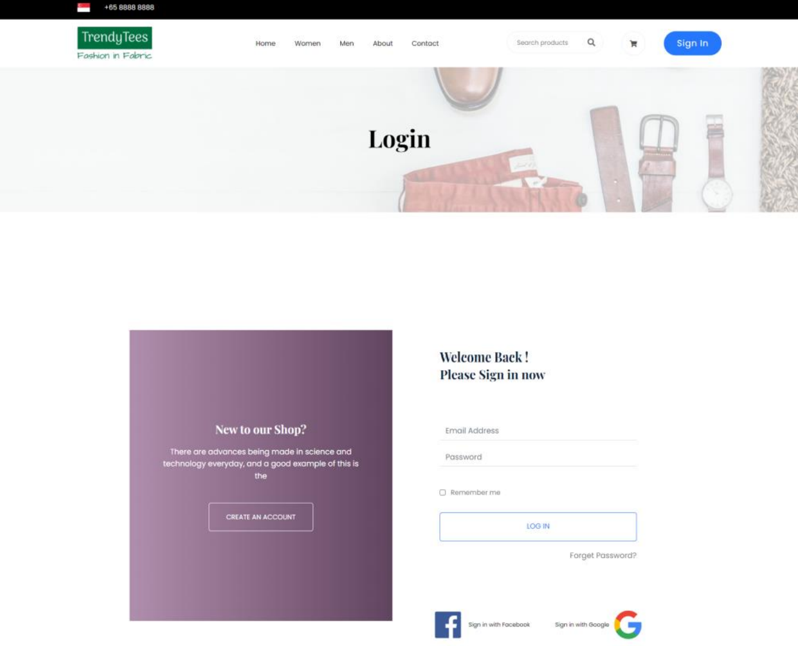

Create more md files like this one as needed. Place them into the same folder 
as this [user_stories folder](./)

# Title: Login/Logout

Allow user to login and logout
 
## Priority: 10 
 

## Estimation: 2 days
* Zhou Jie: 2 days
 

## Assumptions (if any):
Assume users want to log in and log out securely.

## Description: 
Description:

The interface provides users with options to securely log in and log out of their accounts. To log in, users can access their accounts by entering their email address and password. There is also an option to remember login credentials for future access, and users can reset their passwords if they are forgotten. Once logged in, users can securely log out by clicking the "Sign Out" button located at the top right corner, ensuring that their account remains protected.
## Tasks, see chapter 4.

### Front-end:
Task 1: Create a login form with fields for email and password.

Task 2: Add a Sign Out button for logging out and redirecting users to the login page.

Task 3: Implement password reset functionality with email verification and update form.

### Back-end:
Task 4: Develop authentication logic to verify user credentials and hash passwords.

Task 5: Implement session management to handle login sessions and logout processes.

# UI Design:

# Completed:

