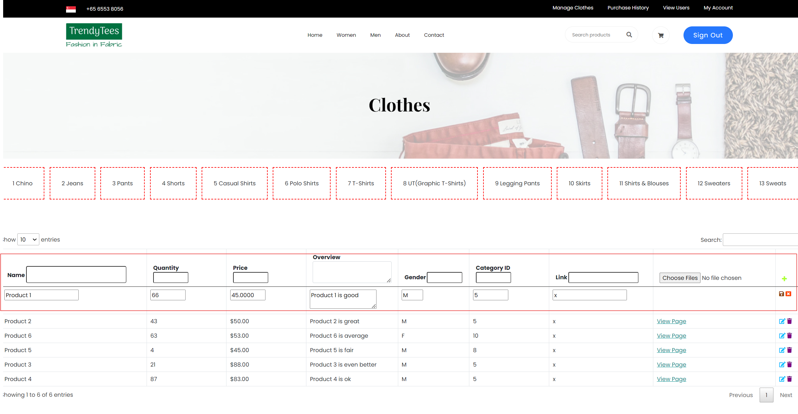

Create more md files like this one as needed. Place them into the same folder 
as this [user_stories folder](./)

# Title: Create a Product

Create a product
 
## Priority: 40 
 

## Estimation: 3
* Zhou Jie: 3 days
 

## Assumptions (if any):
N/A
## Description:  
The product management interface allows administrators to create new products by entering various details in the respective fields. Administrators can input the product name, quantity, and price to define the product's basic details. A brief overview can be added to describe the product's features and benefits for customers. Administrators must select the appropriate category ID to ensure the product is correctly classified, and they can tag the product for a specific gender, such as male, female, or unisex, to facilitate targeted browsing. A URL link can be included to provide additional information or external references. Images of the product can be uploaded by selecting files from the administrator's device. Once all details are entered, administrators can choose to save the new product or cancel the operation if necessary.
## Tasks, see chapter 4.

### Front-end:

Task 1: Develop a form interface for creating a new product.

Task 2: Implement functionality to upload product images from the administrator's device.

Task 3: Add the ability to save the new product or cancel the operation.

### Back-end:

Task 4: Set up an SQL connection to handle the creation and storage of new product details in the database.

Task 5: Implement data validation to ensure all required fields are complete and correct before saving.

Task 6: Develop logic to manage product categorization, gender tagging, and secure storage of uploaded product images.

# UI Design:

 

# Completed:

 
 
