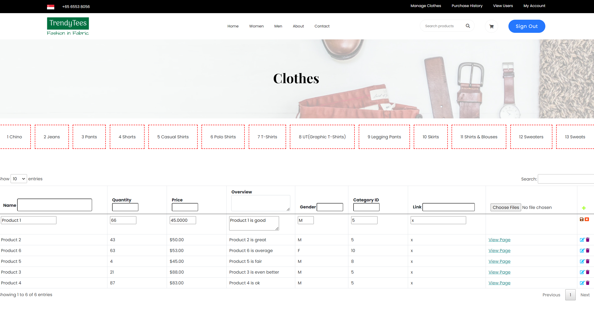

Create more md files like this one as needed. Place them into the same folder 
as this [user_stories folder](./)

# Title: Edit a Product

Create a product
 
## Priority: 40 
 

## Estimation: 7    
* Zhou Jie: 7 days
 

## Assumptions (if any):
N/A
## Description:  
The product management interface allows administrators to efficiently edit existing products in the online shop's inventory. Administrators can update product details by entering the product name, quantity, and price in the respective fields. They can also edit the product's overview to provide customers with information about its features and benefits. Selecting the appropriate category ID is crucial for correctly classifying the product. Products can be tagged for a specific gender, such as male, female, or unisex, to assist with targeted browsing. Administrators can enter a URL link associated with the product for additional information or external references and upload product images by selecting files from their device. Once the details are filled out, administrators have the option to save the changes or cancel the operation if needed.
## Tasks, see chapter 4.

### Front-end:

### Front-end:

Task 1: Develop a form interface for editing existing products, including fields for name, quantity, price, overview, category selection, gender tags, and a URL link for additional information.

Task 2: Add the ability to save changes to the product.

### Back-end:

Task 3: Set up an SQL connection to update product details in the database securely.

# UI Design:

 

# Completed:

 
 
