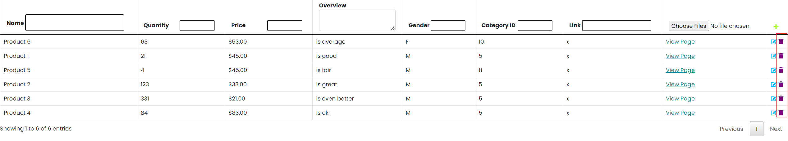

Create more md files like this one as needed. Place them into the same folder 
as this [user_stories folder](./)

# Title: Delete a Product

Delete a product
 
## Priority: 30
 

## Estimation: 3 
* Zhou Jie: 3 days
 

## Assumptions (if any):
Assume administrators want to remove products from the inventory when necessary.
## Description:  
The product management interface allows administrators to manage the inventory by deleting products from the online shop. Administrators can delete a selected entry by clicking the delete icon, which will remove the product from the inventory.
 
## Tasks, see chapter 4.

### Front-end:

Task 1: Add a delete icon or button next to each product entry in the product management interface.

Task 2: Update the product list view dynamically to remove the deleted product from the display immediately.

### Back-end:

Task 3: Set up an SQL query to handle the deletion of the selected product from the database.

Task 4: Implement logic to execute the SQL query securely and ensure the product is removed from the database.

 

# UI Design:

 

# Completed:

 
 
