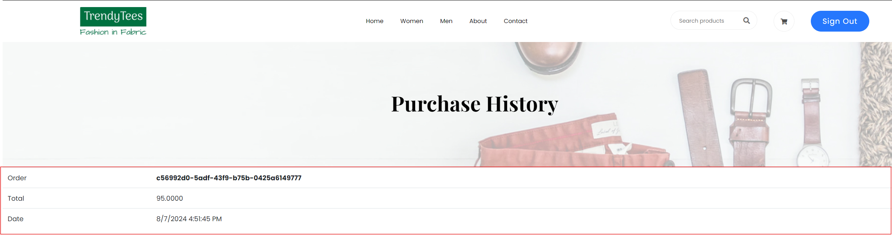

Create more md files like this one as needed. Place them into the same folder 
as this [user_stories folder](./)

# Title: Payment History

Allow the user to see their previous purchase products
 
## Priority: 50
 

## Estimation: 6
* Zhou Jie: 6 days
 

## Assumptions (if any):
Assume users want to view and track their previous purchase history.
## Description:  
The "View Purchase History" interface displays a list of past purchases, allowing users to track and reference specific transactions using each order's unique identifier. For each order, the total purchase amount is displayed, helping users keep track of their spending. Additionally, each entry shows the date and time of the purchase, providing a clear timeline of past orders.

## Tasks, see chapter 4.

### Front-end:

Task 1: Develop an interface to display a list of past purchases, including order identifiers, total purchase amounts, and purchase dates.

Task 2: Implement functionality to dynamically update and display purchase history for the logged-in user.

 
### Back-end:

Task 3: Set up SQL queries to retrieve purchase history data for the logged-in user from the database.

Task 4: Implement logic to format and send the retrieved purchase history data to the front-end.

 
# UI Design:

 

# Completed:
 
 
