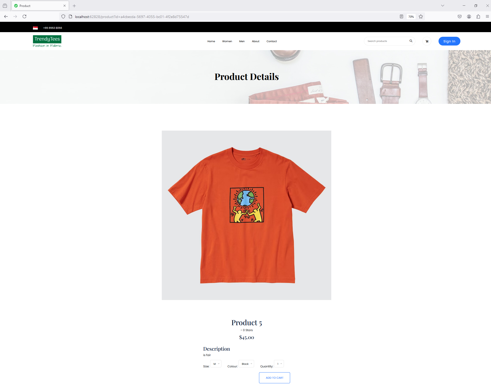

Create more md files like this one as needed. Place them into the same folder 
as this [user_stories folder](./)

# Title: Add Product to Cart

Allow users to add products to their virtual shopping cart 
 
## Priority: 10
 

## Estimation: 5
* Zhou Jie: 5 days
 

## Assumptions (if any):
Assume users want to easily add products to their virtual shopping cart from the product details page.

## Description:  
The product details page, which doubles as the add-to-cart page, allows users to easily add products to their virtual shopping cart. This interface provides comprehensive information about the selected product, including a large, detailed image to give users a clear view of the item. The page displays the product name, price, and a brief description of its features. Users can customize their purchase by selecting options such as size and color from dropdown menus and specifying the desired quantity. Once the selections are made, users can click the "Add to Cart" button to add the product to their shopping cart for later checkout. By combining product browsing and cart addition, this page streamlines the shopping experience into a single, seamless interface.

## Tasks, see chapter 4.

### Front-end:

Task 1: Develop a product details page displaying the product image, name, price, and description.

Task 2: Implement dropdown menus for selecting product options such as size and color.

Task 3: Add an input field to specify the desired quantity of the product.

Task 4: Implement the "Add to Cart" button functionality to add the selected product and quantity to the user's virtual shopping cart.

### Back-end:

Task 5: Set up an SQL connection to retrieve product details and available options from the database.

Task 6: Implement logic to handle the addition of products to the user's shopping cart in the database.

# UI Design:

 

# Completed:
 
 
