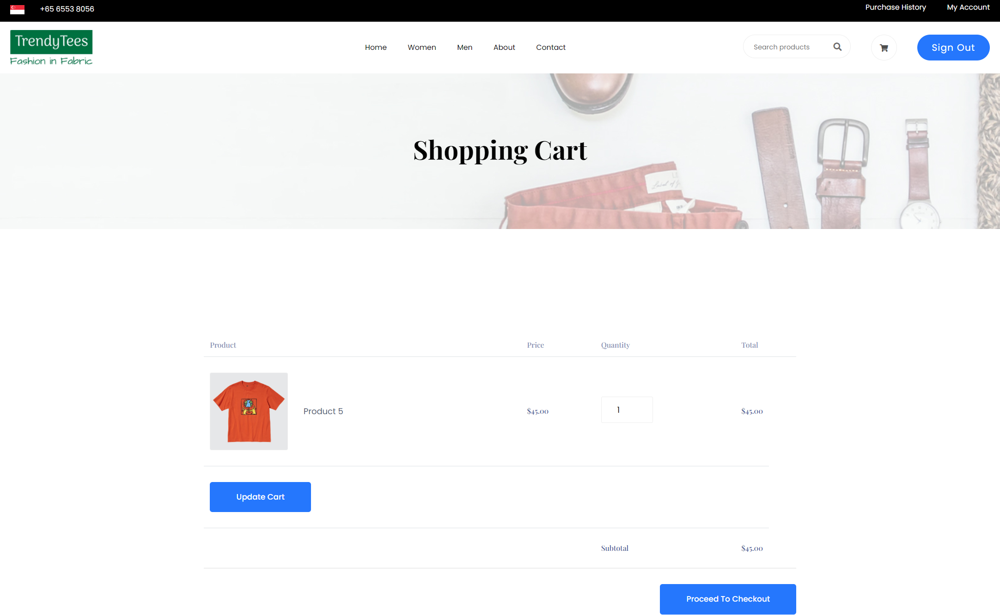

Create more md files like this one as needed. Place them into the same folder 
as this [user_stories folder](./)

# Title: View Cart

User can view their currently cart
 
## Priority: 10
 

## Estimation: 4
* Zhou Jie: 4 days
 

## Assumptions (if any):
Assume users want to view and manage the products currently in their shopping cart.
## Description:  
The shopping cart allows users to view and manage the products they have added to their cart. It displays each product along with its image, name, price, quantity, and total cost, providing users with a clear overview of their selected items. Users can adjust the quantity of each product directly within the cart and update it to reflect these changes. The interface also shows the subtotal of all items, helping users keep track of their spending. Once users have reviewed their selections, they can proceed to checkout by clicking the "Proceed to Checkout" button, allowing them to complete their purchase.
## Tasks, see chapter 4.

### Front-end:

Task 1: Develop a shopping cart interface that displays each product with its image, name, price, quantity, and total cost.

Task 2: Add an "Update Cart" button to reflect changes in product quantities.

Task 3: Display the subtotal of all items in the cart to help users track their spending.

### Back-end:

Task 4: Set up an SQL connection to retrieve the current cart contents for the logged-in user from the database.

 

# UI Design:

 

# Completed:
 
 
