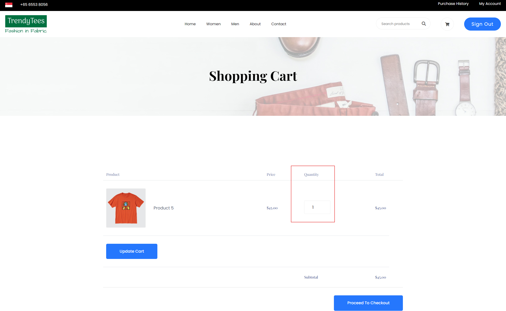

Create more md files like this one as needed. Place them into the same folder 
as this [user_stories folder](./)

# Title: Edit Cart

Allow users to change the quantity or remove products
 
## Priority: 20
 

## Estimation: 5
* Zhou Jie: 5 days
 

## Assumptions (if any):
N/A
## Description:  
The shopping cart interface allows users to edit the quantity of products directly. Users can change the number of items by adjusting the quantity field for each product. If the quantity is set to zero, the product will be removed from the cart automatically. This feature provides users with a simple way to manage their purchases and ensure their cart reflects their current buying intentions.

## Tasks, see chapter 4.

### Front-end:

Task 1: Implement functionality to allow users to change the quantity of each product directly within the cart.

Task 2: Automatically remove a product from the cart if its quantity is set to zero.

Task 3: Add an "Update Cart" button to apply changes to product quantities and update the cart accordingly.

Task 4: Implement a "Proceed to Checkout" button that redirects users to the checkout page to complete their purchase.

### Back-end:

Task 5: Set up an SQL connection to handle updates to product quantities and removal of products in the user's cart.

Task 6: Implement logic to update the product quantities or remove products in the database based on user actions.

# UI Design:

 

# Completed:
 
 
