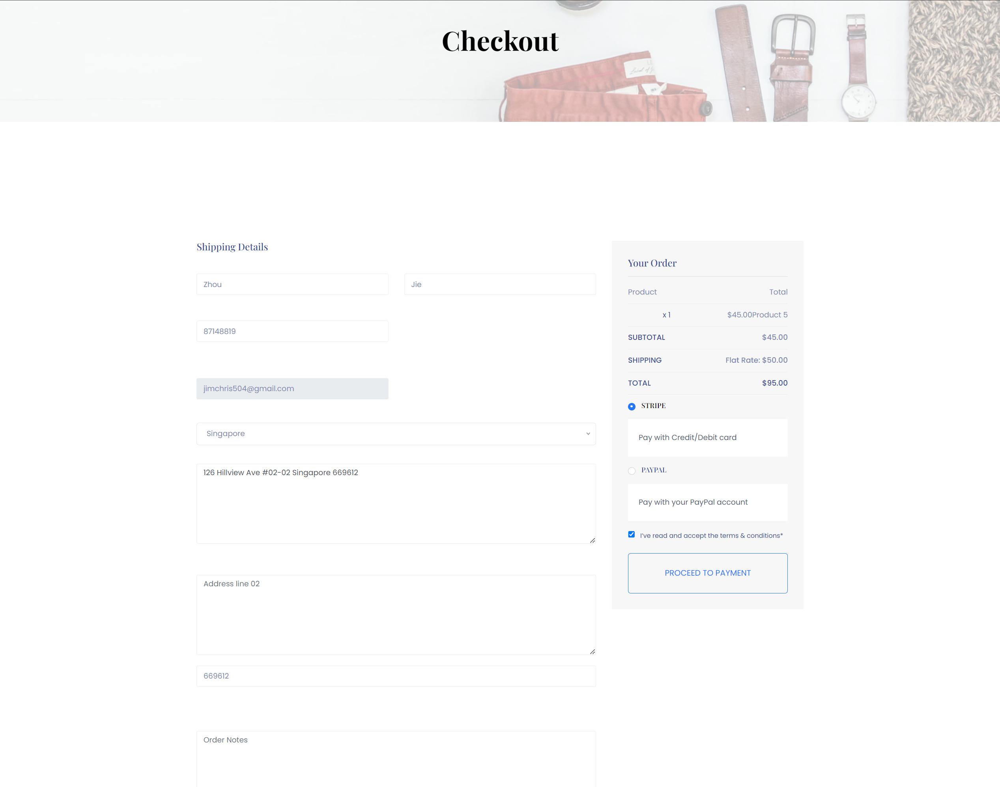
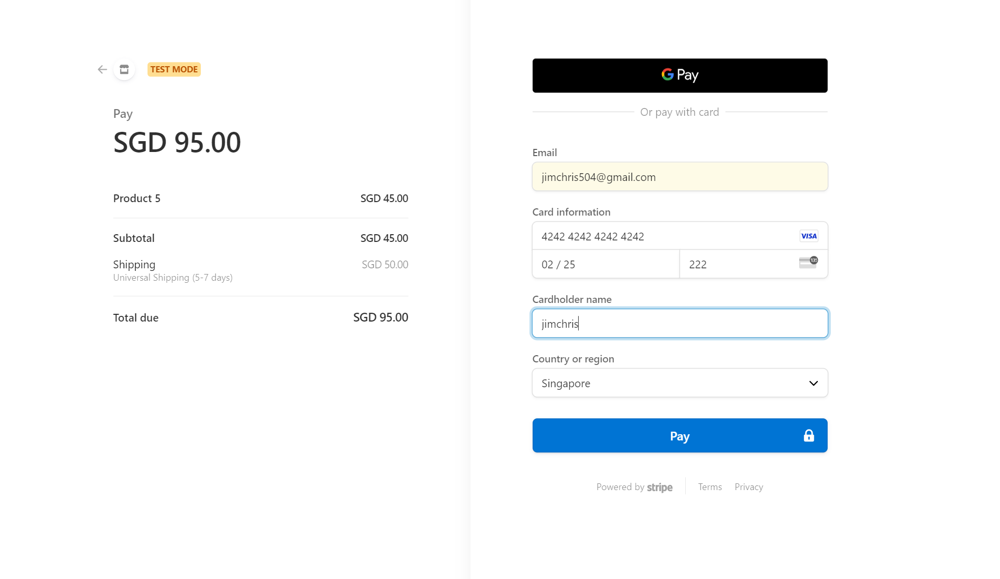

Create more md files like this one as needed. Place them into the same folder 
as this [user_stories folder](./)

# Title: Checkout and Payment

User can pay in different ways.
 
## Priority: 30
 

## Estimation: 5
* Zhou Jie: 5 days
 

## Assumptions (if any):
Assume users want to pay using various methods during checkout.
## Description:  
The checkout process provides users with the flexibility to pay for their orders using different payment methods. After reviewing their shopping cart, users proceed to the checkout interface, where they can enter their shipping details, including name, address, and contact information. The order summary is displayed on the right side, showing the product, subtotal, shipping cost, and total amount due. Users have the option to choose between different payment methods, such as credit/debit card or PayPal. The integration with Stripe API provides a secure and user-friendly template for entering payment information. Users can fill in their card details, including card number, expiration date, and cardholder name, or use alternative payment options like Google Pay for a seamless transaction experience. After verifying the information, users can complete their purchase by clicking the "Pay" button, ensuring a secure and efficient payment process.

## Tasks, see chapter 4.

### Front-end:

Task 1: Develop a checkout interface where users can enter their shipping details.

Task 2: Display an order summary on the checkout page, showing product details, subtotal, shipping cost, and total amount due.

Task 3: Implement functionality to select between different payment methods, such as credit/debit card or PayPal.

Task 4: Integrate Stripe API to provide a secure and user-friendly template for entering payment information.

Task 5: Implement a "Pay" button to complete the purchase after verifying all entered information.

### Back-end:

Task 6: Set up an SQL connection to store and retrieve order and payment details securely.

Task 7: Implement logic to process the payment using the selected payment method, ensuring secure transactions.

Task 8: Integrate Stripe API on the back-end to handle payment processing and validation.

# UI Design:

# Completed:

