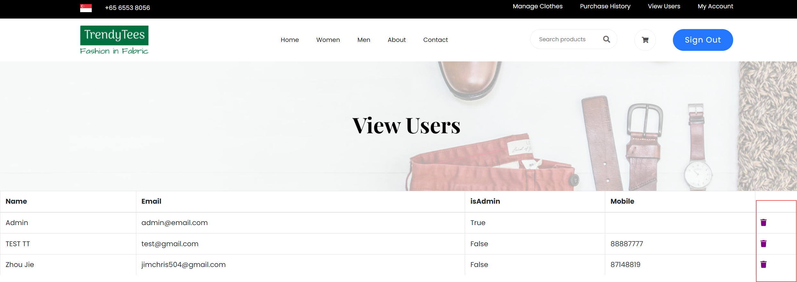

Create more md files like this one as needed. Place them into the same folder 
as this [user_stories folder](./)

# Title: Delete a User

Allow administrator to delete user accounts.

## Priority: 50
 

## Estimation: 3
* Zhou Jie: 3 days
 

## Assumptions (if any):
N/A
## Description:  
The user management interface allows administrators to view and manage user accounts effectively. It displays a list of users, including details such as name, email, admin status, and mobile number. Administrators have the ability to delete user accounts directly from this interface. Each user entry includes a delete icon (represented by a trash bin) that administrators can click to remove the user from the system. 
## Tasks, see chapter 4.

### Front-end:

Task 1: Develop a user management interface to display a list of users, including details such as name, email, admin status, and mobile number.

Task 2: Implement a delete icon (trash bin) next to each user entry to allow administrators to delete user accounts.

Task 3: Add a confirmation dialog to ensure administrators confirm the deletion of user accounts.

### Back-end:

Task 4: Set up an SQL connection to handle the deletion of user accounts from the database.

 
 

# UI Design:

 

# Completed:

 