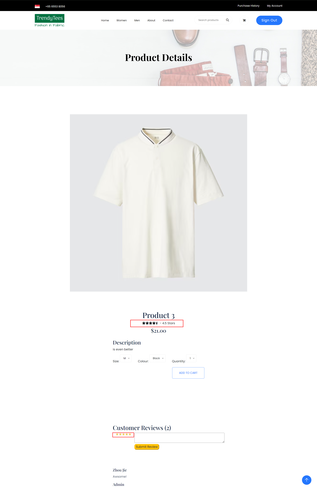

Create more md files like this one as needed. Place them into the same folder 
as this [user_stories folder](./)

# Title: Rating System

Users can leave stars for a product. 

## Priority: 20
 

## Estimation: 2
* Zhou Jie: 2 days
 

## Assumptions (if any):
N/A
## Description:  
The product details interface includes a star rating system that allows users to rate products based on their experiences. Users can leave a star rating out of five, providing valuable feedback for other customers. The overall rating of the product is dynamically calculated based on the cumulative ratings provided by users, meaning the more ratings a product receives, the more accurate the average rating becomes.  

## Tasks, see chapter 4.

### Front-end:

Task 1: Develop a star rating interface on the product details page to allow users to rate products out of five stars.

Task 2: Display the overall product rating based on cumulative user ratings.

### Back-end:

Task 3: Set up an SQL connection to store user ratings in the database.

Task 4: Implement logic to capture user ratings and store them securely in the database.

Task 5: Retrieve cumulative ratings from the database to calculate and display the overall product rating.

# UI Design:

# Completed:

 
