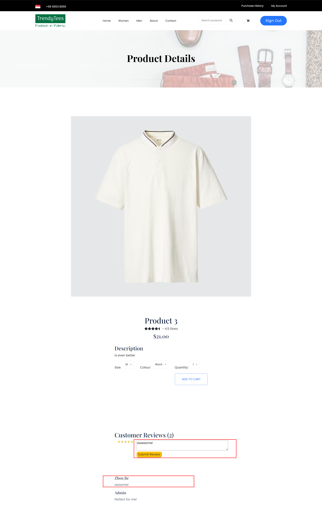

Create more md files like this one as needed. Place them into the same folder 
as this [user_stories folder](./)

# Title: Rating System

Users can leave stars for a product. 

## Priority: 20
 

## Estimation: 2
* Zhou Jie: 2 days
 

## Assumptions (if any):
Assume users want to provide feedback on products through written reviews.

## Description:  
The product details interface enables users to leave written reviews for products. Users can write a review in the provided text box and submit it by clicking the "Submit Review" button. Once submitted, reviews are displayed below the review section, allowing other customers to read feedback from previous buyers. 

## Tasks, see chapter 4.

### Front-end:

Task 1: Develop a review interface on the product details page to allow users to write and submit reviews.

Task 2: Display submitted reviews below the review section for other customers to read.

### Back-end:

Task 3: Set up an SQL connection to store user reviews in the database.

Task 4: Implement logic to capture user reviews and store them securely in the database.

Task 5: Retrieve submitted reviews from the database and display them on the product details page.

# UI Design:

 

# Completed:

 