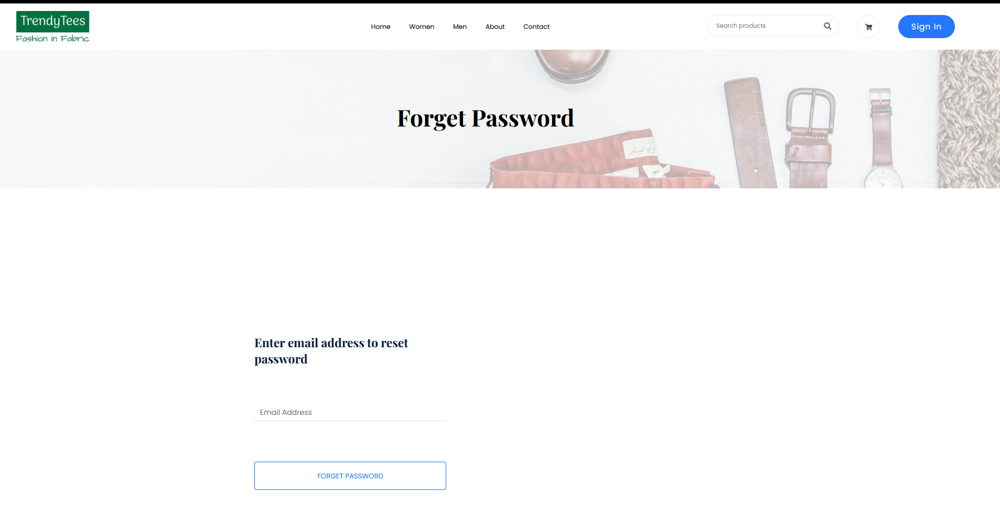
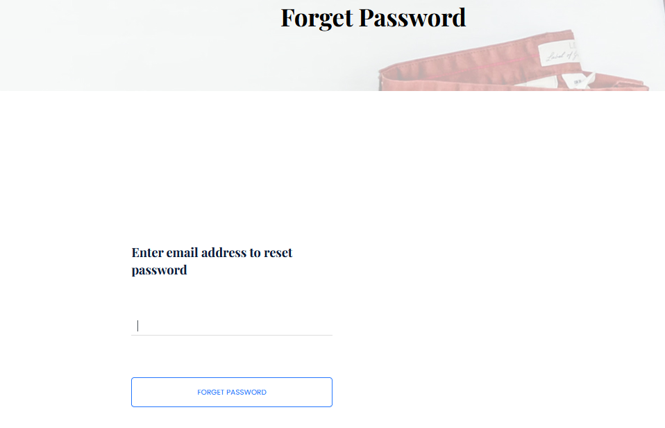
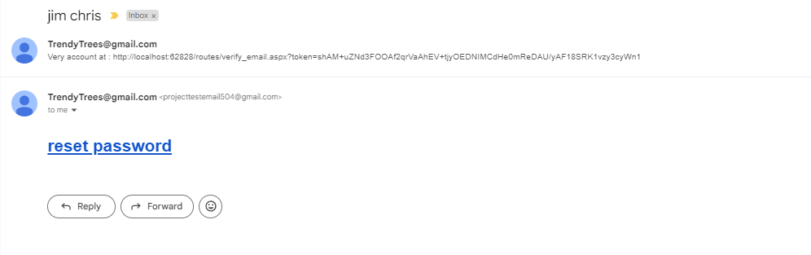
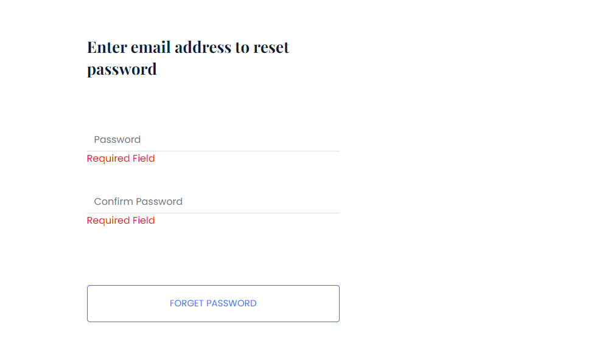

Create more md files like this one as needed. Place them into the same folder 
as this [user_stories folder](./)

# Title: Reset Passsword

Users can reset their password

## Priority: 50
 

## Estimation: 1
* Zhou Jie: 1 days
 

## Assumptions (if any):
Assume users need a secure method to regain access if they forget their password.

## Description:  
The password reset feature allows users to securely regain access to their accounts if they forget their password. Users can initiate the password reset process by entering their registered email address in the provided field on the "Forget Password" page and clicking the "FORGET PASSWORD" button. Upon submission, an email is sent to the user’s email address containing a "reset password" link. By clicking this link, users are directed to a secure page where they can set a new password for their account. This process ensures that only authorized users can reset their passwords, maintaining the security and integrity of user accounts.

## Tasks, see chapter 4.

### Front-end:

Task 1: Develop a form with a input field for users to enter their registered email address.

Task 2: Implement a "Forget Password" button to initiate the password reset process.

Task 3: Create a secure page for users to set a new password after clicking the reset link in their email.

### Back-end:

Task 4: Set up an SQL connection to handle the password reset requests and verify the user's registered email address.

Task 5: Implement logic to generate a secure password reset link and send it to the user's email address.

Task 6: Develop logic to validate the reset link and allow the user to set a new password securely.

Task 7: Ensure secure handling of user data and proper error handling throughout the password reset process.

# UI Design:

 

# Completed:

