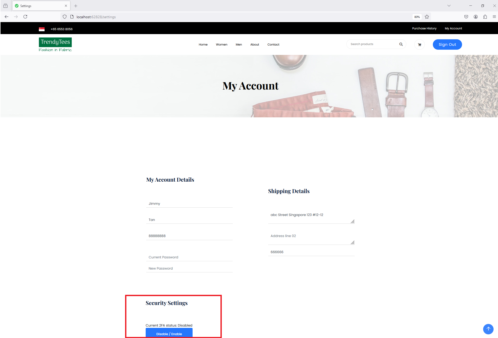
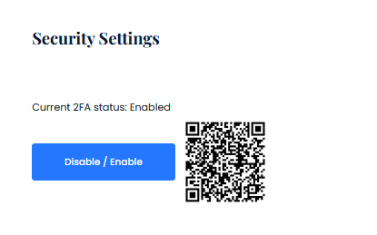
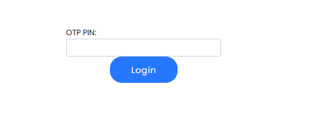

Create more md files like this one as needed. Place them into the same folder 
as this [user_stories folder](./)

# Title: Two Factor Authentication

Users can leave stars for a product. 

## Priority: 50
 

## Estimation: 1
* Zhou Jie: 1 days
 

## Assumptions (if any):
N/A
## Description:  
The security settings interface allows users to enhance their account security by enabling two-factor authentication (2FA) using Google Authenticator. Users can activate 2FA by clicking the "Enable" button in the Security Settings section. Upon activation, a QR code is displayed, which users can scan with the Google Authenticator app on their mobile device to link their account. Once linked, the app will generate a time-based one-time password (TOTP) that users must enter each time they log in, in addition to their regular password. This OTP field is presented during login, ensuring that only users with access to the Google Authenticator app can gain entry to the account. Users have the option to disable 2FA at any time if needed. By implementing 2FA with Google Authenticator, users add an additional layer of security, making it significantly harder for unauthorized parties to access their accounts.

## Tasks, see chapter 4.

### Front-end:

Task 1: Develop a security settings interface to allow users to enable or disable two-factor authentication (2FA).

Task 2: Implement a button to enable 2FA, which displays a QR code for users to scan with the Google Authenticator app.

Task 3: Create an OTP input field on the login page for users to enter the time-based one-time password (TOTP) generated by the Google Authenticator app.

### Back-end:

Task 4: Set up an SQL connection to store and retrieve the 2FA status and secret keys for user accounts.

Task 5: Implement logic to generate and display a QR code for linking the Google Authenticator app with the user's account.

Task 6: Develop logic to verify the OTP entered by the user during the login process.

 

# UI Design:

 

# Completed:

