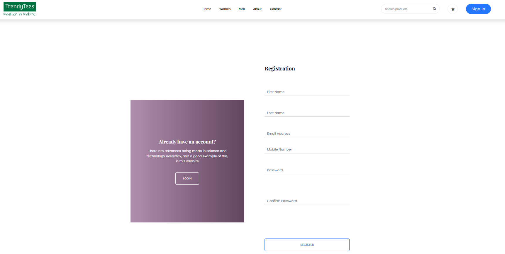
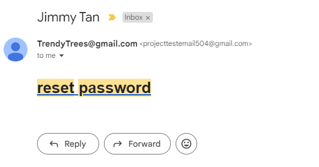

Create more md files like this one as needed. Place them into the same folder 
as this [user_stories folder](./)

# Title: Register

Users register an account.

## Priority: 50
 

## Estimation: 2
* Zhou Jie: 2 days
 

## Assumptions (if any):
Assume new users want to create an account with required personal information.

## Description:  
The registration interface allows new users to create an account on the platform by filling out a registration form with their personal information. Users are required to enter their first name, last name, email address, mobile number, and a password, which they must confirm by entering it again. This ensures that the user’s account is protected with a strong, accurate password. Once all fields are completed, users can click the "Register" button to submit their information. If an account already exists, users can easily switch to the login page by clicking the "Login" button in the prompt provided. This streamlined registration process ensures a seamless onboarding experience for new users while maintaining security and accuracy in user data.

## Tasks, see chapter 4.

### Front-end:

Task 1: Develop a registration form interface with fields for first name, last name, email address, mobile number, and password.

Task 2: Implement functionality to confirm the password by having users re-enter it in a confirmation field.

Task 3: Implement a "Register" button that submits the registration form, triggering form validation and initiating the registration process, including sending a confirmation email.

Task 4: Implement a prompt with a "Login" button for users who already have an account to switch to the login page.

### Back-end:

Task 5: Set up an SQL connection to store and retrieve user registration data securely.

Task 6: Implement logic to validate the registration form data and ensure all required fields are correctly filled.

Task 7: Develop logic to check for existing accounts and handle cases where the email address is already registered.

 

# UI Design:

 

# Completed:

 